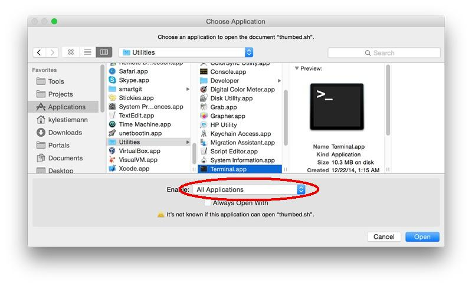

# List Thumbed Up Pandora Songs

This program is a simple script to list all the thumbed up songs from a
https://pandora.com/ station.

## Usage

### Linux/OSX

To list all the thumbed up songs from a Pandora station:

1. Download `thumbed-up-pandora-songs.sh`:

	- Browse to [the raw text version of
	`thumbed-up-pandora-songs.sh`](https://raw.githubusercontent.com/stiemannkj1/thumbed-up-pandora-songs/1.0/thumbed-up-pandora-songs.sh).
	- Right-click and select *Save As...*
	- Name the file `thumbed-up-pandora-songs.sh`.

	Or use `curl`:

		curl -o thumbed-up-pandora-songs.sh 'https://raw.githubusercontent.com/stiemannkj1/thumbed-up-pandora-songs/1.0/thumbed-up-pandora-songs.sh'

	Or use `wget`:

		wget 'https://raw.githubusercontent.com/stiemannkj1/thumbed-up-pandora-songs/1.0/thumbed-up-pandora-songs.sh'

2. Make the file executable:

		chmod +x thumbed-up-pandora-songs.sh

3. Run the file with a https://pandora.com station URL:

		./thumbed-up-pandora-songs.sh https://www.pandora.com/station/play/0000000000000000000

	Alternatively you can run the file from your file manager:

	- On Linux double-click the file and select *Run In Terminal*
	- On OSX right-click the file and select *Open With* > *Other...* >
	  *Applications* > *Utilities* > *Terminal.app*

		**Note:** In the OSX *Choose Application* window, you may need to
		enable *All Applications*:
		<p align="center">
		
		</p>

The program will output a list of songs and the song's artist delimited by
semicolons (`;`). The list is sorted by artist.

Sample Output:

```
Song Title;Artist
A Song;A Artist
Z Song;B Artist
A Song;C Artist
```

The output can be pasted into LibreOffice Calc or Excel to make it easier to
read and sort.

If you want to sort the output on the command line, remove the header with `tail
-n +2` and pipe the result to `sort`. You can the sort column(s) with the `-k`
option and the semicolon (`;`) delimiter with the `-t` option. For example, you
can sort by artist first and title second like so:

	./thumbed-up-pandora-songs.sh https://www.pandora.com/station/play/0000000000000000000 | \
	tail -n +2 | sort -t';' -k2,2 -k1,1

#### Dependencies

`thumbed-up-pandora-songs.sh` depends on:

- [`bash`](https://www.gnu.org/software/bash/)
- [`curl`](https://curl.haxx.se/) or [`wget`](https://www.gnu.org/software/wget/)
- [`sed`](https://www.gnu.org/software/sed/) (either GNU or BSD)

**Note:** OSX and most Linux distros package these programs in their default
installation.

### Windows

**Not supported (yet).**

## License

The code is licensed under the MIT license. This document is licensed under the Creative Commons Attribution 4.0 International License.

<p align="center">
	<a rel="license" href="https://creativecommons.org/licenses/by/4.0/">
		
	</a>
	<br />
	<span xmlns:dct="https://purl.org/dc/terms/" href="https://purl.org/dc/dcmitype/Text" property="dct:title" rel="dct:type"> <em>List Thumbed Up Pandora Songs README.md</em> </span> by <a xmlns:cc="https://creativecommons.org/ns#" rel="cc:attributionURL" href="https://github.com/stiemannkj1/thumbed-up-pandora-songs/blob/master/README.md" property="cc:attributionName"> Kyle J. Stiemann </a> is licensed under a <a rel="license" href="https://creativecommons.org/licenses/by/4.0/">Creative Commons Attribution 4.0 International License</a>.
</p>
